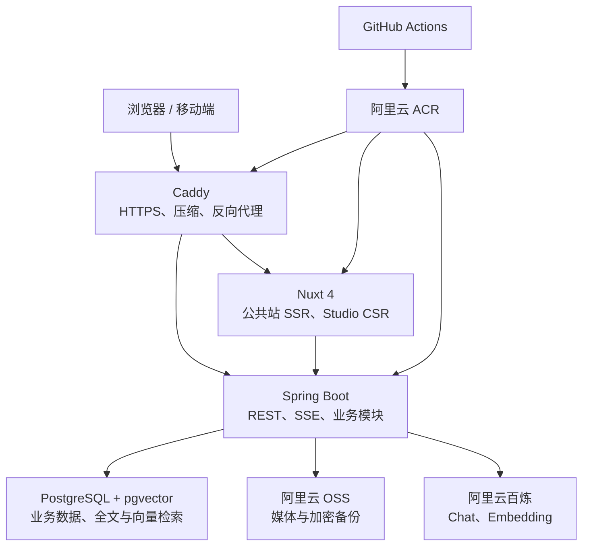
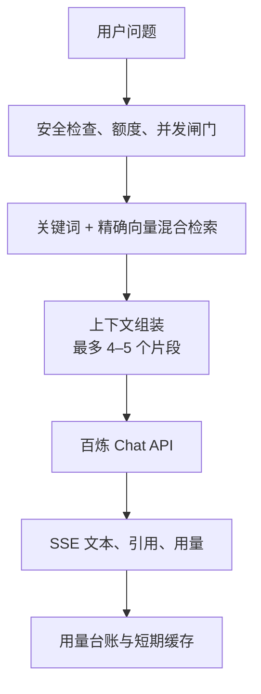

# HaoBlog 完整开发计划（阿里云 2 核 2GB 优化版）

> 适用前提：单站长、中文优先、初期低流量；生产环境为一台阿里云 2 核 2GB 服务器，AI 推理使用阿里云百炼云 API，不在服务器本地运行大模型。
>
> 当前进度（2026-09-07）：阶段六 S6-01～S6-07 已在专用 Docker Desktop 项目完成配置、故障恢复、日志与应用回滚预验收；S6-08 的标准库负载/采样与固定数据工具已实现，最终源码的 API/Web/OpenAPI/Compose/Smoke/完整 Chromium/Bundle/Lighthouse 回归已通过。当前主机实际为 32 CPU、约 7.60 GiB 且有额外容器，正式门禁已拒绝 30 分钟运行；短时 20-worker 预验收的文章 200 HTML P95 为 782.7 ms，未达到 500 ms 门槛。因此 S6-00、S6-08 和依赖它的 S6-09 交接仍阻塞，阶段六未完成。真实 SMTP、真实 OSS/CDN、域名/HTTPS、完整备份恢复、部署、远端 CI/生产与合规材料仍属阶段七；AI 基础与 RAG 保持在阶段八、九。

## 0. 架构结论与约束

HaoBlog 保留完整的 Java + Vue 技术栈、管理后台、评论系统、Nuxt SSR、流式 AI 对话和站内文章 RAG。为使它能够在 2 核 2GB 上稳定运行，V1 必须遵循以下约束：

- 采用单机、单实例、模块化单体，不部署微服务。
- 生产仅运行 Caddy、Nuxt、Spring Boot、PostgreSQL/pgvector 四个容器。
- AI Chat 和 Embedding 全部调用百炼 API；禁止在生产服务器部署 Ollama 或本地模型。
- 不引入 Redis、RabbitMQ、Elasticsearch、Meilisearch、MinIO、Prometheus、Grafana、Uptime Kuma。
- Nuxt、Java 和前端资源都在 GitHub Actions 构建；服务器只拉取镜像并启动，避免构建时内存耗尽。
- 小型知识库先使用 pgvector 精确向量检索，不创建 HNSW。pgvector 默认精确检索可获得完整召回；HNSW 以更多内存换取速度，等数据量和延迟达到阈值后再启用。[pgvector 官方说明](https://github.com/pgvector/pgvector/blob/master/README.md#indexing)
- 单机不追求伪“零停机”。部署允许 30–90 秒维护窗口，换取可预测的内存占用和简单回滚。
- 配置 2GB Swap 只作为 OOM 安全垫；若服务持续使用 Swap，应升级内存，不能把 Swap 当正常运行内存。

这套方案能保留完整 AI 体验，但 2GB 属于“经过约束后可运行”的下限，不是宽裕配置。开发和上线验收必须把内存测试作为硬门槛。

---

## 1. 项目简介与定位

### 1.1 产品定位

HaoBlog 不做“大而全 CMS”，而定位为面向技术开发者的个人数字空间：

- 技术博客：沉淀 Java、Vue、架构与开发实践。
- 数字花园：通过时间线、标签关系和知识星图呈现内容演化。
- AI 知识入口：访客可以基于站内文章提问、追问和解释选中段落。
- 极客工具站：收录常用工具，并提供无需上传数据的浏览器端小工具。
- 个人实验场：承载终端导航、页面彩蛋和后续音乐可视化。

目标用户为技术同行、潜在合作方和普通访客；默认中文优先，预留国际化能力。V1 只有一个管理员，不开放注册、会员、付费阅读和多租户。

### 1.2 成功标准

#### 产品目标

- 博主可在 5 分钟内完成草稿创建、预览和发布。
- 文章发布后 60 秒内在前台、RSS 和 Sitemap 中可见。
- Markdown 支持代码块、目录、数学公式、Mermaid、提示块和代码复制。
- AI 支持站内问答、文章摘要、代码解释、选区问答和后台创作辅助。
- AI 回答展示来源文章和小节；无可靠上下文时明确拒答。
- 评论、AI、音乐和 3D 均有独立 Feature Flag，可即时关闭。

#### 性能与资源目标

- 四个生产容器稳定状态总占用不超过 1.5GB，主机可用内存长期保留至少 300MB。
- 连续 30 分钟压测期间不发生 OOM；Swap 只允许偶发使用，不得持续换入换出。
- 缓存命中的文章页服务端 P95 小于 500ms；普通 API P95 小于 300ms。
- AI 首 Token P95 目标小于 5 秒，完整回答超时上限 75 秒；该指标受模型供应商影响。
- 文章页初始 JavaScript 目标小于 180KB gzip，Three.js 不进入文章主包。
- 移动端关闭重型动画后，文章页 Lighthouse Performance、SEO、Accessibility 目标均不低于 90。

#### 质量目标

- 使用 30–50 条固定问题评测 AI：有答案问题的正确引用率目标不低于 90%，无答案问题的拒答率目标不低于 90%。
- 数据库备份恢复目标：RPO 24 小时、RTO 2 小时。
- 发布失败可在 10 分钟内回滚到上一应用镜像。

### 1.3 开源项目调研与借鉴

| 项目 | 值得借鉴 | HaoBlog 的取舍 |
| --- | --- | --- |
| [Halo](https://github.com/halo-dev/halo) | Java + Vue、内容生命周期、后台和插件生态 | 借鉴内容模型与模块边界，不实现插件运行时 |
| [Solo](https://github.com/88250/solo) | 程序员写作体验、Markdown、导入导出、RSS/Sitemap | 借鉴可迁移性和写作流程 |
| [VitePress](https://github.com/vuejs/vitepress) / [VuePress](https://github.com/vuepress/core) | Vue 驱动 Markdown、快速阅读和 SEO | 借鉴阅读体验，使用 Nuxt SSR 支撑动态内容和 AI |
| [Valaxy](https://github.com/YunYouJun/valaxy) | Vue 3、Vite、主题 Token、Frontmatter | 借鉴轻量主题系统，不引入完整博客框架 |

HaoBlog 的差异化是“文章、工具和 AI 共用同一知识关系”：文章是知识源，工具是可执行入口，知识星图负责导航，AI 负责解释和连接。视觉采用“极夜观测站”，避免普通卡片模板和过度霓虹化。

---

## 2. 技术架构图及核心选型理由

### 2.1 总体架构



同域路由：

- `/`、`/posts/**`、`/garden`、`/tools`：Nuxt SSR/混合渲染。
- `/studio/**`：Nuxt 内的 CSR 管理后台，不执行 SSR。
- `/api/**`：Caddy 直接转发 Spring Boot。
- `/rss.xml`、`/sitemap.xml`：Spring Boot 生成并由 Caddy 短时缓存或设置条件请求。
- AI 流式输出使用 SSE，不引入 WebSocket。
- PostgreSQL 只在 Docker 内部网络开放，不映射公网端口。

Nuxt 4 可部署为 Node 服务并支持混合渲染，适合“公开内容 SSR、后台 CSR”的组合；其生产构建结果可直接运行，无需在服务器安装开发依赖。[Nuxt 部署文档](https://nuxt.com/docs/4.x/getting-started/deployment)

### 2.2 技术选型

| 层级 | 选择 | 选择理由与 2GB 优化 |
| --- | --- | --- |
| Java | Java 21 LTS | 生态成熟、容器感知完善；可开启虚拟线程降低 SSE 连接的线程栈成本 |
| 后端 | Spring Boot 4.1.x、Spring MVC、Spring Security | 模块化单体开发效率高；Spring Boot 4.1 要求 Java 17+，Java 21 在支持范围内。[系统要求](https://docs.spring.io/spring-boot/system-requirements.html) |
| AI | Spring AI 2.0.x | 统一 Chat、Embedding、Memory、RAG 和流式接口；官方提供同步与流式抽象及 PGvector 集成。[Spring AI](https://docs.spring.io/spring-ai/reference/index.html) |
| 前端 | Nuxt 4.x、Vue 3、TypeScript、Vite、pnpm | 保留 Vue 生态，同时提供 SSR、SEO、路由缓存和后台 CSR；Nuxt 4 当前要求 Node 22+，生产建议锁定偶数 LTS。[安装要求](https://nuxt.com/docs/4.x/getting-started/installation) |
| Node | Node 24 LTS | 满足 Nuxt 要求；仅运行构建产物，生产堆上限控制为 192MB |
| 状态管理 | Pinia + `useFetch/useAsyncData` | Pinia 只保存主题、播放器、登录和临时 UI 状态，服务端数据不重复常驻 |
| 公共站 UI | UnoCSS + Reka UI + 自定义 Token | 构建产物小、样式按需生成、容易做独特视觉 |
| 管理后台 | Element Plus 按路由拆包 | 表单、表格、上传成熟；只在 `/studio` 加载 |
| Markdown | `md-editor-v3` + 共享渲染包 | 前后台渲染一致；编辑器仅在后台加载 |
| 内容渲染 | markdown-it、Shiki、KaTeX、Mermaid | 支持代码、公式和图；Shiki 在服务端高亮，Mermaid 客户端懒加载 |
| 数据库 | PostgreSQL 17 + Flyway + Spring Data JPA | 一套数据库覆盖业务、会话、全文和向量；关闭 OSIV，列表使用投影查询 |
| 模糊搜索 | `pg_trgm` + GIN | 文章规模较小时无需独立搜索服务 |
| 向量检索 | pgvector 0.8.x，V1 精确检索 | 避免 HNSW 的额外常驻/构建内存；达到明确阈值后再加索引 |
| 缓存 | HTTP ETag + Nuxt SWR + 有界 Caffeine | 单实例无需 Redis；所有内存缓存必须设置最大条目和 TTL |
| 异步任务 | Outbox + 单线程 Spring Scheduler | 支持摘要、Embedding、邮件和清理任务，不引入 MQ |
| 文件存储 | 阿里云 OSS | 与服务器同云同地域，媒体不占系统盘；通过预签名 URL 直传减少 JVM 内存 |
| AI 供应商 | 阿里云百炼 OpenAI 兼容 API | 推理不占本机 CPU/GPU；百炼提供 Qwen 等模型及 OpenAI 兼容接口。[百炼说明](https://help.aliyun.com/en/model-studio/what-is-model-studio) |
| 网关 | Caddy | 自动 HTTPS、反向代理、压缩，配置量小 |
| 部署 | Docker Compose + GitHub Actions + ACR | 构建在云端 CI 完成，2GB 服务器仅拉取镜像和重启 |
| 测试 | JUnit 5、Testcontainers、Vitest、Playwright | 集成测试放在 CI/开发机，不在生产服务器执行 |

补丁版本在启动开发时通过 BOM/Lockfile 固定；每月集中升级一次，避免生产跟随浮动最新版。

### 2.3 2 核 2GB 资源预算

Docker 默认不会自动限制容器资源，因此生产 Compose 必须显式设置内存和 CPU 上限。[Docker 资源限制](https://docs.docker.com/engine/containers/resource_constraints/)

| 组件 | 内存上限 | 典型目标 | CPU 上限 | 关键设置 |
| --- | ---: | ---: | ---: | --- |
| Caddy | 64MB | 20–40MB | 0.20 核 | 只做 TLS、压缩和路由 |
| Nuxt/Nitro | 320MB | 120–220MB | 0.60 核 | `NODE_OPTIONS=--max-old-space-size=192`，单进程 |
| Spring Boot | 640MB | 400–580MB | 1.25 核 | `-Xms128m -Xmx384m`，虚拟线程，Hikari 最大 6 连接 |
| PostgreSQL | 480MB | 250–400MB | 0.80 核 | `shared_buffers=128MB`、`work_mem=2MB`、最大连接 20 |
| 宿主机与余量 | 约 544MB | 不低于 300MB 可用 | — | OS、Docker、页缓存、SSH、定时任务 |

推荐初始 PostgreSQL 参数：

```text
max_connections = 20
shared_buffers = 128MB
effective_cache_size = 512MB
work_mem = 2MB
maintenance_work_mem = 64MB
wal_buffers = 4MB
autovacuum_max_workers = 2
```

推荐 Spring 初始约束：

```text
JAVA_TOOL_OPTIONS=-Xms128m -Xmx384m -XX:MaxDirectMemorySize=64m -XX:+ExitOnOutOfMemoryError
spring.threads.virtual.enabled=true
spring.datasource.hikari.maximum-pool-size=6
spring.datasource.hikari.minimum-idle=1
spring.jpa.open-in-view=false
server.tomcat.threads.max=20
```

说明：虚拟线程开启后仍限制 Tomcat 接收线程、数据库连接和 AI 并发，防止“线程便宜”演变为无界任务。GC 先使用 JDK 默认 G1；只有压测证明内存不足且暂停可接受时，才评估 Serial GC。

### 2.4 后端模块边界

采用单个 Spring Boot 进程、按业务分包的模块化单体：

- `identity`：管理员、登录、Session、TOTP、权限。
- `content`：文章、分类、标签、版本、发布、RSS/Sitemap。
- `comment`：游客评论、审核、回复、反垃圾。
- `toolbox`：工具分类、链接和内嵌工具配置。
- `ai`：对话、RAG、模型路由、额度、费用和缓存。
- `media`：OSS 预签名上传、文件元数据、引用检查和清理。
- `site`：站点配置、导航、聚合统计和 Feature Flag。
- `shared`：错误协议、审计、Outbox，不反向依赖业务模块。

使用 ArchUnit 检查模块依赖。所有 Outbox 任务由一个调度器串行或小并发执行；Embedding、图片处理和备份不得同时抢占资源。

### 2.5 API 与接口约定

核心接口：

- `GET /api/v1/public/articles`
- `GET /api/v1/public/articles/{slug}`
- `GET /api/v1/public/articles/{slug}/comments`
- `POST /api/v1/public/articles/{slug}/comments`
- `GET /api/v1/public/tools`
- `POST /api/v1/ai/conversations`
- `POST /api/v1/ai/conversations/{id}/messages/stream`
- `/api/v1/admin/articles/**`
- `/api/v1/admin/comments/**`
- `/api/v1/admin/tools/**`
- `/api/v1/admin/media/**`
- `/api/v1/admin/ai/**`

约定：

- OpenAPI 为前后端契约，生成 TypeScript 类型。
- 错误统一为 `application/problem+json`，包含 `code`、`title`、`detail`、`traceId`。
- 后台使用 Spring Session JDBC 与 `HttpOnly + Secure + SameSite=Lax` Cookie；不把 JWT 放入 Local Storage。
- 修改接口使用 CSRF Token 和乐观锁；冲突返回 `409 Conflict`。
- AI SSE 事件固定为 `meta`、`delta`、`citation`、`usage`、`done`、`error`。
- AI 断开连接后立即取消上游模型调用；客户端不自动无限重连。
- 公开列表使用游标或 `page/size`；后台支持筛选、排序和分页。
- 文章、工具和站点配置返回 ETag；Nuxt 公开内容使用 60 秒 SWR。
- Caddy 对 SSE 禁止响应缓冲，并把上游超时设置为高于应用的 75 秒限制。

---

## 3. 功能模块拆解

### 3.1 文章与内容管理

#### 编辑体验

- Markdown 源码、分屏预览、纯预览三种模式。
- 每 15 秒自动保存；浏览器 IndexedDB 再保存一份灾难恢复草稿。
- 标题、Slug、摘要、封面、分类、标签、发布时间和 SEO 字段独立编辑。
- 图片先在浏览器压缩，再使用后端签发的短期预签名 URL 直传 OSS。
- 文章状态：`DRAFT`、`SCHEDULED`、`PUBLISHED`、`ARCHIVED`。
- 发布生成不可变版本快照，支持比较和回滚。
- 限时预览链接允许正式发布前跨设备检查。
- 乐观锁避免两个标签页静默覆盖同一草稿。

#### Markdown 能力

- Shiki 双主题代码高亮、行号、行聚焦、文件名和复制按钮。
- 标题生成稳定锚点和悬浮目录。
- KaTeX、Mermaid、任务列表、脚注和提示块。
- 禁止原始 HTML 和任意 Vue 组件，服务端使用白名单清洗最终 HTML。
- Mermaid 客户端懒加载并使用安全配置；正文先输出可读 SSR HTML。

#### 发布与分发

1. 发布事务写入文章状态、版本和 Outbox 事件。
2. 公开页在 60 秒内通过 SWR 自动刷新。
3. 单线程后台任务依次更新纯文本、搜索字段、分块、Embedding 和摘要。
4. RSS、Sitemap、Canonical、Open Graph、JSON-LD 同步更新或按版本缓存。
5. 支持 Markdown ZIP 导入导出，附件清单与文章一起导出。

V1 不生成耗资源的动态 OG 图片，优先使用文章封面或统一站点模板图。

### 3.2 评论与访客互动

默认采用“游客可用、即时发布、事后管理”：

- 游客填写昵称和可选邮箱；邮箱加密保存，原始 IP 不持久化。
- 支持一级回复，不实现无限嵌套。
- 新评论直接进入已通过状态；保留待审核状态用于兼容历史数据，并支持标记垃圾、拒绝、用户删除。
- Honeypot、最短填写时间、内容指纹、Bucket4j 限频、每日轮换 IP-HMAC。
- 默认单设备每 10 分钟 3 条、每天 10 条。
- 评论只接受纯文本和少量安全链接，不接受图片和原始 HTML。
- 新评论通过 Outbox 异步发送已发布通知；邮件失败不影响评论入库或公开展示。
- 站长可关闭全站或单篇评论。

限频桶放在有界内存缓存中即可；评论的最终管理状态存数据库。单实例重启导致短期限频重置可以接受，但 AI 预算和日额度必须持久化。

### 3.3 完整 AI 智能助手

#### 交互形式

- 全局右下角“信号终端”浮钮。
- 桌面端展开为约 420px 侧边抽屉，移动端为全屏底部面板。
- 文章选中文字后显示“解释代码 / 通俗解释 / 继续追问”。
- 文章页提供“问这篇文章”，默认限定当前文章。
- 管理后台编辑器右侧提供创作面板，生成内容必须人工确认后写入。
- 当 AI 关闭、超额或供应商故障时，保留本地全文搜索和相关文章推荐，不出现空白面板。

#### 能力范围

访客端：

- 基于站内文章回答技术问题。
- 当前文章摘要、要点提取、代码解释和概念比较。
- 推荐相关文章和工具。
- 多轮追问，回答中展示文章标题、小节和可点击引用。
- 无站内证据时说明“知识库中没有足够依据”，不伪造来源。

站长端：

- 生成提纲、摘要、标题、SEO 描述和标签建议。
- 润色指定段落、解释代码、生成示例和检查逻辑缺口。
- 将零散笔记整理为草稿。
- 批量为旧文章生成摘要与 Embedding。
- 所有生成内容进入预览/差异对比，不自动发布。

#### RAG 数据流



发布侧流程：

1. 文章按标题层级切分为约 500–800 Token 的片段，重叠约 80 Token。
2. 片段保存文章版本、小节、顺序、文本哈希和 Token 数。
3. 只对新增或文本哈希变化的片段调用 Embedding。
4. Embedding 维度由所选模型配置固定，迁移模型时新建版本列/表，不原地混写不同维度。
5. 旧文章的批量向量化由单线程 Outbox 执行，避免瞬时 CPU、内存和费用峰值。

查询侧流程：

1. 校验长度、敏感输入、会话、设备日额度、全站预算和并发数。
2. 同时执行 `pg_trgm` 关键词候选和 pgvector cosine 精确候选。
3. 当前文章场景优先过滤 `article_id`，全站场景过滤已发布版本。
4. 合并候选并取 4–5 个片段；总上下文设置硬 Token 上限。
5. 将知识片段显式标记为“不可信引用材料”，系统提示不可被文章内容覆盖。
6. 调用百炼 OpenAI 兼容接口并流式返回。
7. 在输出结束后统一落库引用、Token、延迟、模型别名和估算费用。

Spring AI 提供流式模型 API 和 PGvector VectorStore 抽象；百炼提供 OpenAI 兼容接口，因此模型供应商可通过配置切换，不必改动业务接口。[Spring AI 模型 API](https://docs.spring.io/spring-ai/reference/api/index.html)、[Spring AI PGvector](https://docs.spring.io/spring-ai/reference/api/vectordbs/pgvector.html)

#### 模型与配置策略

代码只识别模型别名，不硬编码具体型号：

| 别名 | 用途 | 策略 |
| --- | --- | --- |
| `fast` | 默认问答、摘要、标签、改写 | 低成本、低延迟模型 |
| `quality` | 复杂代码解释和高质量创作 | 仅管理员或预算充足时使用 |
| `embedding` | 文章和问题向量化 | 固定维度的文本 Embedding 模型 |

`Base URL`、模型名、API Key、超时、输出上限和单价全部配置化。生产 API Key 只存在于服务器 root 可读的环境文件或后续 KMS 中，绝不进入 Nuxt `runtimeConfig.public`、Git 仓库或日志。

#### 2GB 主机的 AI 并发与内存保护

- 全站最多 3 个同时进行的 AI 流；单访客最多 1 个。
- 等待队列最多 10 个请求，超过后返回 `429` 和可重试时间。
- 单次输入默认不超过 2,000 字符；输出默认不超过 800 Token。
- 单次检索上下文默认不超过 4,000 Token。
- 流式请求总超时 75 秒、上游连接超时 5 秒、流空闲超时 20 秒。
- 客户端断开后取消上游请求，释放连接和预算预留。
- 后台批量 AI 任务并发固定为 1，公开 AI 有活动时可暂停后台任务。
- 对话只携带最近 6–8 轮；更早内容压缩为会话摘要，避免上下文无限增长。
- Spring AI 重试最多 1 次，只对可安全重试的连接/限流错误生效；流已经输出后不自动重试整段。

#### 成本控制

- 游客默认每天 5 次；全站默认每天 100 次；管理员额度独立。
- 月度硬预算默认 50 元，日预算由月预算动态拆分。
- 达到月预算 80%：访客只使用 `fast`，暂停后台批量任务。
- 达到 100%：关闭访客实时生成，只保留缓存摘要、全文搜索和管理员可见告警。
- `ai_usage_ledger` 按请求预留预算，完成后按实际 Token 结算，避免并发穿透硬上限。
- 相同文章版本、规范化问题、模型别名组成缓存键；公共问答缓存 1–7 天，有界 Caffeine 只作一级缓存，数据库缓存作为可选二级缓存。
- Embedding 仅在文章版本变化时重算。
- 非实时批量任务可评估百炼 Batch API；官方文档显示兼容 Batch 的任务可低于实时调用成本，但实际支持模型和价格以上线时官方页面为准。[百炼 Batch API](https://help.aliyun.com/en/model-studio/batch-interfaces-compatible-with-openai/)

#### 安全、隐私与合规边界

- 模型不能执行系统命令、直接访问数据库或访问任意 URL。
- V1 只开放“文章检索”和“工具检索”两个只读能力，不开放通用 Tool Calling。
- 文章、评论和用户输入都视为不可信内容，不能覆盖系统规则。
- 对输入与输出执行长度、协议、敏感内容和 Markdown 链接安全检查。
- AI 回答显示“AI 生成，仅供参考”和引用来源，提供举报/反馈入口。
- 匿名对话原文默认 30 天删除；用量聚合可长期保留但不含原文。
- 用户可立即清除当前会话；日志不得记录完整 Prompt、Cookie 或 API Key。
- 《人工智能生成合成内容标识办法》及配套标准已于 2025 年 9 月 1 日施行。HaoBlog 是否属于具体适用范围应在上线前结合服务方式确认；工程上默认提供清晰的交互界面显式标识，并预留生成内容元数据标识能力。[国家网信办通知](https://www.cac.gov.cn/2025-03/14/c_1743654684782215.htm)

### 3.4 工具箱

工具类型：

- `LINK`：外部网站或个人项目。
- `EMBEDDED`：HaoBlog 内置工具。
- `SHOWCASE`：个人项目截图、技术栈和仓库链接。

V1 功能：

- 分类、标签、关键词搜索、收藏置顶和使用频率排序。
- JSON 格式化/校验、Base64、URL 编解码、时间戳转换、正则测试。
- 内置工具完全在浏览器运行，默认不上传用户输入。
- 大文本放入 Web Worker，避免阻塞页面。
- 内嵌工具由后端 `componentKey` 映射前端组件，禁止保存任意 HTML/JavaScript。
- 外部链接只允许 `https`，新窗口附加安全 `rel` 属性。

PWA 离线工具箱提前放入阶段五；Service Worker 仍需保持缓存范围最小，并在无 JavaScript、Save-Data 和更新失败时安全降级。

### 3.5 创新功能

#### A. 知识星图 / 数字花园

- 文章、标签、分类和工具组成可缩放关系图。
- 节点大小表示关联度，颜色区分内容类型。
- 点击节点显示预览，双击进入正文。
- 使用 Canvas + D3 Force；移动端退化为时间线。
- 图数据由后端一次性输出精简 JSON，设置节点数量上限，不在浏览器拉取全文。

#### B. 安全终端导航

按 `Ctrl/Cmd + K` 或彩蛋打开终端：

```text
help
ls posts
grep "Spring AI"
open /posts/spring-ai
ask "如何实现 RAG"
theme blueprint
```

它只是浏览器内白名单命令解析器，不连接服务器 Shell。

#### C. “问这一段”文章助手

选择正文或代码后直接解释，自动携带文章 ID、版本和小节。选区长度、上下文和输出均受 AI 限额控制。这是 HaoBlog V1 的核心辨识点。

#### D. 全局音乐与信号可视化（阶段五）

- 使用 Web Audio API 绘制频谱和波形。
- 路由切换时不中断，但默认不自动播放。
- 音频从 OSS/CDN 加载，不经过 Spring Boot。
- 仅使用原创、CC 授权或已获得授权的音乐。

#### E. 页面彩蛋（阶段五）

- 404 页面为轻量“丢失信号修复”小游戏。
- 连续点击 Logo 切换蓝图模式。
- 阅读完成触发克制的“信号锁定”动画。

---

## 4. UI/UX 设计方案

### 4.1 视觉主题：极夜观测站

采用“科学观测仪器 + 数字花园”，而不是霓虹堆叠：

- 深墨绿黑 `#06110F`：主背景。
- 磷光青绿 `#A8FF60`：核心交互色。
- 警示橙 `#FF9D3D`：状态和强调。
- 雾青 `#8DB7AC`：正文辅助色。
- 浅色模式使用纸张蓝图风。
- 背景使用低对比网格、轨道线、噪点和扫描纹理。

字体策略：

- 标题可使用得意黑的子集化 WOFF2。
- 正文优先系统中文字体栈，阅读模式可选择霞鹜文楷子集。
- 代码使用 Maple Mono NF CN 的必要字符子集。
- 禁止一次加载多个完整中文字体文件；全部 `font-display: swap`。

### 4.2 页面布局

- 首页：非对称 Hero，左侧个人信号档案，右侧交互轨道星图。
- 文章列表：观测日志时间线，而非标准三列卡片。
- 文章页：正文居中，左侧阅读进度，右侧 TOC/AI 抽屉；窄屏合并为底部控制栏。
- 工具箱：设备控制台式分类矩阵。
- Studio：高信息密度和高效率，不加载 Three.js、背景噪点和音乐模块。

### 4.3 动效与性能预算

- 首屏只保留一个高影响动效；GSAP 编排一次分层入场。
- Three.js 仅首页动态导入，离开首页释放场景、纹理和监听器。
- 移动端、低性能设备、节省流量模式和 `prefers-reduced-motion` 使用静态 SVG。
- 页面切换控制在 250–400ms。
- 常规动画只修改 `transform` 和 `opacity`。
- 首页 3D 资源首包外加载，压缩后目标小于 500KB；失败时不影响导航和内容。
- AI 抽屉虚拟化长对话，代码块延迟高亮，避免多轮对话占用过多浏览器内存。

### 4.4 可访问性与响应式

- 所有功能支持键盘访问和可见焦点。
- 颜色对比达到 WCAG AA。
- 终端、播放器和 AI 抽屉使用正确 ARIA 语义。
- 不依赖颜色表达状态。
- 重点测试 360px、768px、1280px、1600px。
- 触摸设备不依赖 Hover；代码块和表格可横向滚动。
- SSE 输出通过 `aria-live` 克制播报，避免逐 Token 干扰读屏用户。

---

## 5. 数据模型设计概要

统一使用 UUIDv7、UTC 时间、Flyway 迁移和必要的乐观锁字段。

| 实体 | 关键字段与关系 |
| --- | --- |
| `user` | 管理员账号、密码哈希、角色、TOTP、最后登录；V1 仅一名管理员 |
| `article` | 标题、Slug、Markdown、渲染 HTML、纯文本、摘要、封面、状态、发布时间、SEO、当前版本 |
| `article_revision` | `article_id`、Markdown 和元数据快照、修改原因、创建者 |
| `category` | 名称、Slug、描述、排序；文章属于一个主分类 |
| `tag` / `article_tag` | 标签及文章多对多关系 |
| `comment` | 文章、父评论、昵称、加密邮箱、正文、状态、IP-HMAC、审核信息 |
| `tool_category` | 工具分类、图标、排序 |
| `tool` | 类型、标题、描述、链接、`component_key`、标签、状态、排序 |
| `media_asset` | OSS Key、URL、MIME、大小、尺寸、SHA-256、引用状态 |
| `conversation` | 匿名会话哈希、场景、关联文章、摘要、创建与过期时间 |
| `conversation_message` | 角色、内容、模型别名、引用 JSON、Token、延迟、创建时间 |
| `article_chunk` | 文章版本、小节、内容、顺序、文本哈希、Embedding、模型版本、Token 数 |
| `ai_usage_ledger` | 会话、设备哈希、模型、输入/输出 Token、预留/实际费用、状态、日期 |
| `ai_quota_daily` | 日期、主体类型、主体哈希、请求数、Token、费用；保证持久化额度 |
| `ai_response_cache` | 缓存键、文章版本、模型别名、回答、引用、过期时间；可选二级缓存 |
| `outbox_event` | 事件类型、聚合 ID、Payload、状态、重试次数、下次执行时间 |
| `site_setting` | 站点标题、导航、主题、Feature Flag、社交链接等非敏感配置 |
| `audit_log` | 管理操作、目标类型/ID、结果、时间、Trace ID |
| `page_view_daily` | 日期、页面、UV/PV 聚合；不保存完整访问轨迹 |

约束与索引：

- `article.slug`、`category.slug`、`tag.slug` 唯一。
- 文章状态和发布时间联合索引。
- 评论按文章、状态、创建时间索引。
- 标题、摘要、纯文本正文使用 `pg_trgm` GIN。
- `article_chunk` 先按 `article_revision_id`、发布状态、文本哈希建立普通索引。
- V1 不给 `embedding` 建 HNSW；当片段超过 20,000 或向量查询 P95 连续一周超过 200ms，再在压测和备份后评估 HNSW。
- 媒体使用 SHA-256 去重。
- 匿名 IP-HMAC 每日换盐，不提供跨日跟踪。
- 浏览量先在内存中聚合，每 5 分钟批量写入，避免每次访问更新数据库。
- 文章归档代替物理删除；评论保留审核事实但可清除公开正文。

数据保留：

| 数据 | 默认期限 |
| --- | --- |
| 匿名对话原文 | 30 天 |
| AI 用量聚合 | 12 个月或按统计需要保留 |
| 审计日志 | 90 天 |
| 普通应用日志 | 7–14 天，且受磁盘大小上限约束 |
| 数据库备份 | 7 个日备份、4 个周备份、6 个按月备份 |

---

## 6. 开发阶段与里程碑

按单人兼职每周 15–20 小时估算，V1 约 11 周。完整 AI 保留，但先完成非 AI MVP、前端体验、本地生产候选和运行保障；AI 开发不再占用阶段五至七的时间，也不得阻塞非 AI 版本上线。域名备案周期不作为阶段五、六本地开发的阻塞条件。

| 阶段 | 时间 | 交付与验收 |
| --- | ---: | --- |
| 0. 基线与原型 | 3–4 天 | 信息架构、Token、线框、API 草案、2GB 资源预算、AI 评测题集 |
| 1. 工程骨架 | 第 1 周 | Nuxt/Spring、PostgreSQL/pgvector、Flyway、OpenAPI、Compose、CI、管理员登录 |
| 2. 内容核心 | 第 2–3 周 | 文章 CRUD、标签分类、编辑器、自动保存、版本、OSS 媒体、预览发布 |
| 3. 公开阅读 | 第 4 周 | 首页、列表、文章 SSR、TOC、Shiki、SEO、RSS/Sitemap、响应式 |
| 4. 评论、工具与搜索 | 第 5 周 | 评论即时发布/限频/事后管理、工具管理、5 个内嵌工具、中文搜索，形成可上线非 AI MVP |
| 5. 非 AI 体验与本地收口 | 第 6 周 | 已完成本地收口：知识星图、终端导航、首页标志性动效、性能降级、音乐、频谱、404 小游戏、PWA；均不依赖 AI 或备案 |
| 6. 2GB 加固与本地生产候选 | 第 7 周 | 内存上限、并发闸门、30 分钟压测、故障降级、日志轮转和回滚路径 |
| 7. 外部上线准备与备案 | 第 8 周 | 真实 OSS、备份/恢复流程、CI 制品、域名/HTTPS、ACR、部署演练、备案材料和隐私/评论规则；等待真实域名时先完成其余项目 |
| 8. AI 基础 | 第 9 周 | 百炼 Chat/Embedding、SSE、会话、额度、费用台账、取消与超时 |
| 9. RAG 与创作 | 第 10 周 | 分块、混合检索、引用、选区问答、后台创作、缓存、固定问题评测 |
| 10. AI 灰度与观察期 | 第 11 周 | 先向站长开放 AI，观察 7 天并修复 OOM/5xx/费用问题，再决定访客灰度 |
| V1.1 | 第 12 周后 | 非核心体验优化、复杂动效细节和后续实验功能 |

### 6.1 开发优先级

P0（必须）：

- 管理员登录、文章全流程、SSR 阅读、OSS 媒体、搜索、备份和恢复演练。
- 评论即时发布、事后管理与全局 Feature Flag。
- 2GB 内存约束、故障降级、生产候选和回滚路径。

P1（首发尽量）：

- 知识星图、终端导航、首页标志性动效、性能降级、音乐播放器、频谱可视化、404 小游戏和 PWA。
- 浏览聚合、限时预览链接及其他不依赖 AI 或备案的体验增强。
- 在非 AI 生产候选验收通过后接入完整 AI 对话、RAG 引用、选区问答、后台创作、额度和硬预算。

P2（V1.1）：

- 复杂动画细节、非核心彩蛋和其他体验优化。

### 6.2 测试计划

后端：

- JUnit 5：文章状态机、Slug、评论发布与管理、额度、费用预留/结算和缓存键。
- Testcontainers：真实 PostgreSQL + pgvector，验证迁移、全文、精确向量检索。
- WireMock：模拟 AI 流式成功、超时、限流、中断、半途断流和供应商错误。
- ArchUnit：保证模块依赖方向。
- 并发保存同一草稿必须返回明确 `409`。

前端：

- Vitest：编辑器、TOC、终端解析器、AI 状态机和 Feature Flag。
- Playwright：登录、写作发布、评论即时发布与管理、工具、AI 流和移动端。
- SSR 测试：无 JavaScript 时仍存在正文、Meta 和 JSON-LD。
- Chrome、Edge 和 Safari 移动视口回归。

AI 评测：

- 30–50 条固定问题覆盖直接答案、跨文章问题、无答案、提示注入和代码解释。
- 验证引用确实包含支持回答的原文，不只检查链接存在。
- 验证低相似度拒答、模型超时、超预算、断线取消和缓存回退。
- 保存评测指标，不保存模型隐藏推理过程。

安全：

- Markdown、评论、Mermaid 和链接协议的 XSS 测试。
- 登录暴力尝试、CSRF、对象越权、上传伪造 MIME、路径穿越测试。
- AI Prompt 注入、超长输入、Markdown 恶意链接和日志泄密测试。
- 依赖漏洞扫描在 CI 执行，不在生产机运行扫描器。

资源验收场景：

1. 文章页 20 个并发读请求。
2. 3 个并发 AI SSE + 10 个排队请求。
3. 发布文章并执行分块/Embedding，同时保持正常阅读。
4. 执行 `pg_dump` 时访问文章和 AI。
5. 重启 Nuxt/API/数据库，验证健康检查和降级页面。

硬性通过条件：无 OOM、无持续 Swap、数据库连接不耗尽、AI 超限返回可理解错误、普通阅读不被 AI 任务拖垮。

---

## 7. 部署与运维建议

### 7.1 生产主机与拓扑

推荐：

- 阿里云 2 核 2GB，系统盘建议至少 40GB；若当前磁盘更小，应先核对可用空间。
- Ubuntu 24.04 LTS 或阿里云官方长期支持 Linux 镜像。
- 创建 2GB Swap，`vm.swappiness` 建议 10–20，仅用于避免瞬时 OOM。
- Docker Engine + Compose Plugin。
- 四容器：`caddy`、`web`、`api`、`postgres-pgvector`。
- OSS 与服务器选择同地域；媒体和数据库加密备份不长期留在系统盘。
- ACR 保存带 Git SHA 的前后端镜像。

生产不运行：MinIO、数据库管理 UI、CI Runner、测试容器、监控面板、本地模型。

### 7.2 系统与容器加固

- 公网只开放 80/443；SSH 22 仅密钥登录并限制来源 IP。
- 禁止 root 密码远程登录；启用安全组和主机防火墙。
- PostgreSQL、Actuator、Docker Socket 不暴露公网。
- 容器使用非 root 用户、只读根文件系统（确有写入需求的目录单独挂载）、`no-new-privileges`。
- Secret 存放于仓库外、root 可读的生产环境文件，权限 `600`。
- Docker 日志轮转：单文件 10MB、最多 3–5 个；应用日志避免重复落盘。
- 每周清理未使用且已确认可删除的旧镜像，只保留当前和上一稳定版本。
- 服务器不安装 Node/Maven 构建链，减少攻击面和磁盘占用。

### 7.3 CI/CD

GitHub Actions 流程：

1. 后端单元测试、Testcontainers 集成测试和依赖检查。
2. 前端类型检查、Vitest、构建和关键 Playwright 测试。
3. 生成 Nuxt 运行镜像和 Spring Boot JRE 镜像，标签为 Git SHA。
4. 推送到阿里云 ACR。
5. SSH 到服务器，检查可用内存、磁盘和当前备份状态。
6. 拉取新镜像；运行向前兼容的 Flyway 迁移。
7. 在维护窗口执行 `docker compose up -d`，依次恢复 DB、API、Web、Caddy 健康。
8. 检查首页、文章 API、登录和 AI 健康探针。
9. 成功后记录版本；失败则回滚应用镜像。

2GB 主机不做蓝绿发布，因为同时运行两套 Web/API 可能直接触发 OOM。数据库迁移必须采用“新增字段/表 → 双读或兼容读 → 数据迁移 → 后续版本删除”的 Expand/Contract 策略，应用回滚不依赖数据库回滚。

### 7.4 备份与恢复

- PostgreSQL 每日低峰期执行一次 `pg_dump -Fc`。
- 备份完成后压缩/加密并上传 OSS；上传成功再清理本机临时文件。
- 保留 7 个日备份、4 个周备份、6 个按月备份。
- OSS 开启版本控制和生命周期规则；版本控制可保留被覆盖/删除对象的历史版本，生命周期负责清理过旧版本。[OSS 版本与生命周期](https://help.aliyun.com/en/oss/user-guide/configure-lifecycle-rules-to-manage-object-versions)
- 每月验证备份文件可解密、可列出；每季度在本地或临时实例执行完整恢复演练。
- Flyway 脚本、Compose 配置和部署脚本进入 Git；生产 Secret 不进入备份仓库。
- 可选启用阿里云磁盘快照，但快照不能替代可移植的 `pg_dump`。

### 7.5 轻量监控

2GB 主机不自建 Uptime Kuma、Prometheus 和 Grafana。采用：

- 阿里云主机监控：CPU、内存、磁盘、网络和进程异常。
- 外部 HTTP 探针：检查首页、`/api/health/readiness` 和证书。
- Spring Actuator 只向容器内网暴露 health；详细 metrics 默认关闭或按需临时开启。
- `docker stats` 和系统命令用于故障诊断；Docker 官方可直接查看容器 CPU、内存、网络和磁盘 I/O。[Docker Stats](https://docs.docker.com/reference/cli/docker/container/stats/)
- 告警：可用内存低于 250MB、Swap 持续增长、磁盘超过 75%、连续 5xx、备份失败、AI 费用达到 80%、AI 供应商错误率超过 20%。
- 日志统一带 `traceId`，普通日志保存 7–14 天且设置总量上限；审计日志保存数据库。

### 7.6 域名与中国大陆上线

中国内地服务器上的非经营性网站通常需要完成 ICP 备案，具体流程按阿里云接入和当地管理要求执行。[工信部备案指南](https://hunca.miit.gov.cn/bsfw/bszn/art/2024/art_7ef0d8bd3b0d433ba4b9b277f883f74d.html)

上线顺序：

1. 域名实名认证并确认服务器满足备案接入要求。
2. 完成 ICP 备案。
3. 按当前要求完成公安联网备案。
4. 页脚展示备案号、隐私说明、评论规则和 AI 内容说明。
5. 公开评论和 AI 上线前复核所在省份要求、百炼服务条款、生成内容标识和个人信息处理规则。
6. AI 与评论分别灰度开放，遇到合规或审核问题可即时关闭，不影响文章阅读。

### 7.7 发布前检查清单

- [ ] 主机可用磁盘不少于 10GB。
- [ ] 四个容器都设置资源上限、健康检查和日志轮转。
- [ ] API Key、数据库密码、Session Secret 不在仓库和前端产物中。
- [ ] PostgreSQL 未映射公网端口。
- [ ] 备份已成功上传并完成至少一次恢复测试。
- [ ] AI 日额度、月预算、并发、超时、输出上限已生效。
- [ ] AI 断线能够取消百炼上游请求。
- [ ] 评论和 AI Feature Flag 已验证。
- [ ] 首页、文章、404、RSS、Sitemap、Canonical 和 HTTPS 正常。
- [ ] 连续 30 分钟资源验收无 OOM 和持续 Swap。
- [ ] 备案、隐私、评论和 AI 标识信息已展示。

---

## 8. 潜在风险、对策与升级路线

### 8.1 风险与应对

| 风险 | 应对 |
| --- | --- |
| 2GB 内存不足 | 严格资源上限、有界缓存、单线程后台任务、外部 AI、Swap 安全垫；达到阈值优先升级 4GB |
| AI 并发拖垮普通访问 | AI 全局信号量、短队列、数据库连接隔离、后台任务让路、独立超时 |
| AI 成本失控 | 持久化额度、费用预留、全站日限额、月度硬预算、模型分级、缓存 |
| AI 幻觉或错误引用 | 混合检索、限制上下文、强制引用、低相似度拒答、固定评测集 |
| 提示注入与越权 | 知识内容不可信、工具只读白名单、不执行命令/URL、输出安全处理 |
| 百炼故障 | 超时、熔断、最多一次安全重试；降级为全文搜索、缓存摘要和相关文章 |
| 评论垃圾或违法内容 | 限频、Honeypot、Feature Flag、发布通知、事后隐藏与管理记录；上线前补充评论规则和举报入口 |
| Markdown/Mermaid XSS | 禁止原始 HTML、服务端清洗、协议白名单、严格 CSP |
| SSR 内存上涨 | 60 秒 SWR、有界缓存、Node 堆上限、后台 CSR、定期观察堆和重启原因 |
| HNSW 构建 OOM | V1 使用精确检索；达到数据/延迟阈值后在 4GB 或临时扩容环境构建 |
| 数据库连接耗尽 | Hikari 最大 6、PostgreSQL 最大 20、慢查询超时、后台任务单并发 |
| 部署时内存峰值 | CI 外部构建、单套原地重启、维护窗口、禁止蓝绿双实例 |
| 单机故障 | OSS 异地备份、版本化镜像、恢复演练；接受单机无高可用 |
| 媒体占满磁盘 | 浏览器直传 OSS、系统盘不保存原图、生命周期与引用清理 |
| 国内合规变化 | AI/评论独立开关、显式标识、上线前复核最新规则和供应商条款 |
| 功能过多延期 | P0 优先；阶段五先做轻量音乐、PWA、小游戏和降级路径，复杂动画细节与非核心彩蛋继续后置 |

### 8.2 升级到 4GB 的硬触发条件

满足任一条件并持续出现，就应优先把服务器升级到 4GB，而不是继续堆参数：

- 一周内两次 OOM 或容器被系统杀死。
- 正常流量下主机内存连续 15 分钟超过 85%。
- Swap 连续 10 分钟有明显换入换出，且影响请求延迟。
- 3 个 AI 流运行时普通文章/API P95 超过 1 秒。
- `pg_dump`、发布向量化或日志轮转期间服务频繁超时。
- Nuxt 320MB 或 Spring 640MB 上限无法在正常功能下稳定运行。

升级 4GB 后先增加运行余量，不立即引入更多中间件。

### 8.3 后续扩容触发条件

| 触发条件 | 下一步 |
| --- | --- |
| 文章片段超过 20,000 或向量查询 P95 > 200ms | 评估 HNSW；先备份、压测并观察构建内存 |
| 数据库持续 CPU > 70% 或备份明显影响服务 | 升级主机或迁移阿里云 RDS PostgreSQL |
| 需要两个 API 实例 | 引入 Redis 共享 Session、限频和缓存，再配置负载均衡 |
| Outbox 每分钟持续积压 > 1,000 | 先优化任务与批处理，再评估消息队列 |
| 文章 > 5,000 且全文搜索 P95 > 300ms | 评估 Meilisearch，不直接上 Elasticsearch |
| 日 PV > 10,000 或媒体流量明显上升 | 为 OSS 媒体配置 CDN，增加页面缓存策略 |
| 明确要求高可用 | 拆分数据库、应用多实例、负载均衡和集中监控 |

### 8.4 已锁定决策

- 保留 Spring Boot、Nuxt、PostgreSQL/pgvector、管理后台、自建评论和完整 AI 助手。
- 生产 AI 只使用云 API；Ollama 仅作为开发机可选适配器。
- 保留 Nuxt SSR，但 Studio 使用 CSR，重型模块全部路由懒加载。
- V1 使用精确向量检索，不创建 HNSW。
- V1 不使用 Redis、MQ、独立搜索、MinIO 或自建监控平台。
- 服务器不执行 Maven、pnpm、镜像构建和集成测试。
- 单机发布接受短维护窗口，不做蓝绿。
- AI 默认月度硬预算 50 元，可在后台调整。
- 初始目标流量低于 10,000 PV/日、AI 同时流式会话不超过 3 个。
- 如果出现稳定性压力，第一优先级是升级到 4GB，其次才是拆服务。

---

## 9. 最终实施建议

最稳妥的上线顺序是：

1. 完成文章、管理后台、OSS、SSR、搜索、评论、工具和备份，作为非 AI MVP。
2. 在域名备案等待期间先完成知识星图、终端、首页动效、性能降级、音乐、频谱、404 小游戏和 PWA，并逐项验证低性能与无 JavaScript 路径。
3. 在测试环境用与生产相同的容器上限完成 30 分钟资源压测、故障降级、备份恢复和本地生产候选验收。
4. 域名备案完成后补齐真实 OSS、域名/HTTPS、ACR、部署演练、远端 CI/生产和合规验收；未完成备案不阻塞前述本地开发。
5. 接入百炼 Chat/Embedding，完成 SSE、RAG 引用、选区问答、后台创作、额度和硬预算。
6. 先只向站长开放 AI，观察费用、引用和内存 3–7 天，再以“每天 5 次、全站并发 3、月预算 50 元”向访客灰度开放。

这份方案不是削弱完整 AI，而是把大模型推理、批量构建、媒体和备份移出 2GB 主机，把有限内存只留给 Web、业务、数据库和流式连接。只要严格执行资源上限、并发闸门和升级阈值，2 核 2GB 可以作为 HaoBlog 的首发配置；若希望减少调优时间并获得更宽松的稳定性，升级到 2 核 4GB 仍是性价比最高的第一步。
