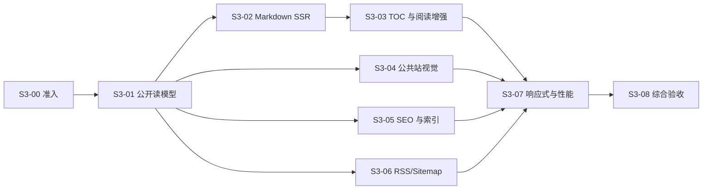

# HaoBlog 阶段 3：公开阅读完整开发计划

## 一、目标与边界

阶段 3 将 HaoBlog 从“能够 SSR 展示文章”提升为完整的公开阅读产品：

- 首页、文章时间线和文章详情形成统一的“极夜观测站”静态阅读体验。
- 标题、正文、TOC、代码、公式和主要 SEO 信息均存在于 SSR HTML。
- 支持安全的高级 Markdown：Shiki、KaTeX、Mermaid、表格、任务列表、脚注、提示块和代码复制。
- 完成 Canonical、Open Graph、Twitter、JSON-LD、RSS 和 Sitemap。
- 满足 360/768/1280/1600px、无 JavaScript、Save-Data、reduced-motion 和键盘访问。
- 文章初始 JavaScript 小于 180KB gzip，Performance、SEO、Accessibility 均达到 90。

明确不做：评论、工具箱功能、AI/RAG、知识星图、Three.js、终端解析器、音乐、404 游戏、真实部署和域名备案。

设计主线采用“仪器，而非装饰”和“可读性永远赢”；首页只完成 SSR 校准首屏与近期观测日志，不留下空的星图占位。

S3-08 收口状态（2026-08-22）：

- Java 21.0.11 环境已恢复；API `-DskipITs verify` 49 项和 PostgreSQL/pgvector Failsafe 36 项均通过。
- Web typecheck、66 项 Vitest、生产构建、客户端预算和完整 8 项 Chromium Playwright 均通过。
- 文章初始客户端静态闭包为 60,932 bytes gzip；Mermaid 位于异步 chunk，未把 Shiki、编辑器或 Three.js 放入初始闭包。
- Lighthouse 移动端 Performance、Accessibility、SEO 均为 1.00；Best Practices 0.96 的已知项是 `.test` HTTPS 图片不会真实联网。
- 独立生产 Compose 项目中的 Caddy、Web、API、PostgreSQL/pgvector 全部健康，资源限制与端口隔离已在运行时读取验证。
- 工作树中的演示稿和既有未跟踪文件未删除、未提交；本轮未执行提交、推送、部署或云资源变更。
- 仓库没有 `.openai/hosting.json`，继续使用既有 Nuxt、Spring Boot、Caddy、Compose 架构；Sites 不创建项目或部署。
- 远端 CI、真实 OSS、真实域名 HTTPS、备案、ACR 和自动部署未在本轮执行，不得宣称上线验收通过。

## 二、接口与实现决策

### 公开契约

- `SiteResponse` 增加 `siteUrl`、`authorName`；由 `HAOBLOG_PUBLIC_BASE_URL` 和 `HAOBLOG_AUTHOR_NAME` 提供，生产必须配置，开发默认 `http://localhost:3000` 和 `Hao`。
- `ArticleSummary` 只保留列表需要的 `id/slug/title/excerpt/publishedAt/coverImageUrl`，删除 Markdown 和 SEO 正文数据。
- `ArticleResponse` 增加 `modifiedAt`，并修正 `publishedAt` 为文章真实发布时间，不再用版本快照创建时间代替。
- ETag 必须包含公开版本 ID、真实发布时间、分页信息和影响响应的媒体数据。
- 前台页码使用 1 起始，API 继续使用 0 起始；`?page=1` 永久重定向到 `/articles`，非法或越界页返回 404。
- 增加 `GET /rss.xml` 和 `GET /sitemap.xml`，写入 OpenAPI；RSS 返回最近 20 篇摘要，Sitemap 分批读取全部公开文章。
- 不新增数据库表；公开数据继续来自不可变 `article_revision` 与文章公开状态。

### Markdown SSR 数据流

```text
Spring 公开文章 API
  → Nuxt /_content/articles/{slug} 公开读模型
  → 服务端 Markdown 解析、安全清洗和代码高亮
  → { article, renderedHtml, toc, hasMermaid }
  → 文章页 SSR
  → 可选的轻量客户端增强
```

- 使用 `markdown-it`，设置 `html=false`、`linkify=false`、`typographer=false`；选择已修复相关性能安全问题的兼容稳定版本。[markdown-it 官方仓库](https://github.com/markdown-it/markdown-it)
- 使用 `@mdit/plugin-footnote`、`@mdit/plugin-tasklist`、`@mdit/plugin-container` 和 `@mdit/plugin-katex`，不引入整套预设。[Markdown It Plugins](https://mdit-plugins.github.io/)
- Shiki 只存在于 Nitro 服务端，采用细粒度语言/主题包、JavaScript 正则引擎和单例高亮器；未知语言回退为纯文本，不进入文章客户端包。[Shiki 性能建议](https://shiki.style/guide/best-performance)
- 支持 Java、Kotlin、Vue、TypeScript、JavaScript、HTML/XML、CSS、JSON、YAML、SQL、Shell、PowerShell、Dockerfile、Markdown 和纯文本。
- 代码围栏元数据固定为 ```` ```lang [file.ext] {1,3-5} ````，支持文件名、行号、聚焦行和复制按钮；非法元数据忽略并转义。
- 文章标题是页面唯一 `h1`；正文标题整体下移一级。TOC 收集渲染后的 `h2/h3`。
- 标题 ID 使用 NFKC、Unicode 字母数字、小写化和连字符规范化；空标题回退 `section`，重复标题追加 `-2/-3`。
- 链接只允许站内绝对路径、`https:` 和 `mailto:`；图片只允许 `https:`；禁止 `javascript:`、`data:`、原始 HTML 和任意 Vue 组件。
- 提示块仅支持 `note/tip/warning/danger`；任务复选框只读；脚注回链必须键盘可达。
- KaTeX 使用美元与括号两套分隔符，`trust=false`、严格模式、有限 `maxSize/maxExpand`；错误公式回退为可读源码。[KaTeX 安全选项](https://katex.org/docs/options)
- Mermaid 首次进入视口后动态加载，配置 `startOnLoad=false`、`securityLevel=strict`、`maxTextSize=50000`、`maxEdges=500`；无 JS 或渲染失败时保留源码。[Mermaid 安全级别](https://mermaid.js.org/config/schema-docs/config-properties-securitylevel.html)
- 最终 HTML 再经服务端标签、属性、协议和 Shiki/KaTeX 样式白名单清洗。

### SEO 与索引策略

- 使用可信配置的站点根地址生成 Canonical，不信任转发 Host。
- 文章 JSON-LD 使用 `BlogPosting`，包含标题、摘要、作者、站点、Canonical、封面、`datePublished`、`dateModified` 和 `inLanguage=zh-CN`；不嵌入 Markdown 正文。
- `/`、`/articles`、有效分页、`/about` 和公开文章允许索引。
- `/studio/**`、预览链接、404、尚未实现内容的 `/garden`、`/tools` 设置 `noindex,nofollow`。
- Sitemap 只包含 `/`、`/articles`、`/about` 和公开文章，不包含分页、预览、Studio 或占位页。
- RSS/Sitemap 由 Spring Boot 使用 JDK XML API生成，不新增 Java Feed 依赖；Caddy 将两个精确路径转发至 API并保留条件缓存。
- 保留现有 `og-default.svg`，文章有 HTTPS 封面时优先使用封面，不生成新的社交预览图。

## 三、任务划分



### S3-00：冻结阶段 3 基线，2–4 小时

- 记录当前分支、HEAD、远端 CI 结果和所有用户改动。
- 删除 `PublicSiteController` 中明显异常的无关注释；演示稿和无关未跟踪资产不纳入阶段 3，用户明确要求更新的阶段文档按 S3-08 收口范围处理。
- 恢复 Java 21，并先运行 API 单测确认真实基线。
- 保存阶段 3 起始 Commit，不提交、不推送，除非用户另行授权。

验收：阶段 3 文件与用户资产边界清晰，Java 21、Web 基线和 `git diff --check` 可执行。

### S3-01：公开文章读模型与缓存契约，8–12 小时

- 修正公开发布时间、分页、投影查询和列表过量字段。
- 增加 `modifiedAt/siteUrl/authorName` 契约并重新生成客户端。
- 首页读取最近 5 篇文章；列表增加 1 起始的上一页/下一页导航。
- 统一 API/Nuxt 的 404、ETag、304 和 60 秒共享缓存行为。

验收：草稿、未到期定时文、归档文不可见；列表不返回 Markdown；发布修改在 60 秒内可见；API 类型无手写副本。

### S3-02：安全高级 Markdown SSR 引擎，18–26 小时

- 建立服务端读模型和单一 Markdown 解析/清洗管线。
- 实现基础语法、表格、任务列表、脚注、提示块、KaTeX、Shiki 和 Mermaid 源码回退。
- 对渲染结果设置版本化 ETag；解析或高亮失败只降级相关块，不使文章整体 500。
- 限制输入大小、公式展开、Mermaid 文本/边数及高亮语言集合。

验收：恶意 HTML、协议、公式和图表配置不能越过白名单；Shiki/KaTeX 不进入文章客户端初始包；未知语言和错误公式仍可阅读。

### S3-03：文章结构、TOC 与轻量增强，10–14 小时

- 桌面采用左信号进度、中间 720px 正文、右侧 TOC 的仪器布局。
- 移动端将进度压缩为细线，TOC 使用原生 `<details>` 抽屉。
- TOC、正文锚点由同一 token 流生成；支持重复中文标题、键盘导航和深链接。
- 复用一个滚动监听器驱动 Dock 与左侧进度；IntersectionObserver 仅增强当前章节状态。
- 增加代码复制、Mermaid 懒加载和失败提示；无 JS 时正文、源码与锚点仍完整。

验收：页面只有一个 `h1`；TOC/正文 ID 一致；复制和图表增强失败不影响阅读。

### S3-04：公共站完整静态视觉，10–14 小时

- 完善全局发丝线、正文舞台、48px Dock 和 CSS 径向 INDEX；Dock 仍只有 INDEX、⌘K、AI。
- 首页实现“信号校准”SSR 首屏和近期观测日志，不加载 Three.js 或空星图占位。
- 列表实现带封面、时间戳和摘要的单列观测时间线，不转成卡片网格。
- 文章页保证正文对比度、代码/表格横向滚动、封面尺寸稳定和图片懒加载。
- ⌘K 与 AI 继续保持明确禁用状态，不提前实现后续功能。

验收：360px 无横向页面溢出；触摸不依赖 Hover；设计保持极夜观测站而非通用博客模板。

### S3-05：完整 SEO 与索引边界，8–12 小时

- 为首页、列表、About 和文章生成 title、description、Canonical、Open Graph、Twitter。
- 文章输出安全的 `BlogPosting` JSON-LD。
- 添加全站 RSS `<link rel="alternate">`。
- 固化分页、旧/非法 slug、404、占位页、Studio 和预览链接的索引策略。

验收：SSR 源码中即可看到全部 Meta、Canonical 和 JSON-LD；JSON-LD 可解析且不含不可信脚本终止序列。

### S3-06：RSS、Sitemap 与网关路由，8–12 小时

- Spring Boot 生成 RSS 2.0 和 Sitemap XML。
- RSS 固定最近 20 篇，只有标题、摘要、绝对链接、稳定 GUID 和发布时间。
- Sitemap 使用 500 条一批读取，最多 50,000 URL，正确 XML 转义。
- 支持 ETag、304 和短时共享缓存；Caddy 精确转发两个 XML 路径。
- 本地 Nitro 提供轻量代理，使 `localhost:3000/rss.xml` 与生产入口一致。

验收：草稿、预览、归档和未来文章不出现在 XML；响应 Content-Type、绝对 URL 和缓存头正确。

### S3-07：响应式、无障碍与性能预算，8–12 小时

- 覆盖 360/768/1280/1600px、键盘、可见焦点和触摸路径。
- SSR 根据 `Save-Data` 请求头设置降级状态，客户端再同步 `navigator.connection.saveData`。
- reduced-motion 禁用扫描、平滑滚动和 TOC 过渡；Save-Data 下 Mermaid 只在用户主动请求后加载。
- 增加构建产物预算脚本，递归统计文章路由初始 gzip 资源并拒绝 Three.js、编辑器、Shiki、KaTeX JS 和 Mermaid 初始加载。
- 使用开发依赖中的固定版本 Lighthouse CI 验证文章移动端 Performance、SEO、Accessibility 均不低于 0.90。

验收：文章初始 JS ≤180KB gzip；SSR 首屏无布局阻塞；高级渲染没有进入 Studio 或其他无关包。

### S3-08：契约、E2E、文档与阶段验收，8–12 小时

- 增加高级 Markdown 固定样例，覆盖重复标题、代码元数据、公式、图表、脚注、提示块、表格、任务和恶意输入。
- Playwright 验证首页、分页、文章、TOC、Meta、JSON-LD、RSS、Sitemap、图片与 404。
- 使用禁用 JavaScript的浏览器上下文确认正文、TOC、公式、代码和 Mermaid 源码存在。
- 在生产 Compose 中验证 Caddy、Web、API 路由及缓存。
- 更新 README、本地启动指南、CI 和 `docs/第三阶段目标任务.md`；只有真实脚本存在后才更新命令清单。

验收：本节所有自动化和手工性能门槛通过，阶段 3 之外的功能没有提前实现。

实际结果：固定文章、分页、SEO/XML、四档视口、无 JavaScript、Save-Data、reduced-motion、键盘焦点、生产拓扑、客户端预算和 Lighthouse 均已通过本地自动化；修复了客户端分页查询复用、HTML 语言、进度条名称、代码复制名称、INDEX 名称和脚注链接辨识度。阶段三之外的评论、工具箱功能、AI、RAG、Three.js、终端和部署均未实现。

总工作量约 80–118 个理想小时；按每周 15–20 小时估算约 4–8 周。选择“完整高级 Markdown”后，不再沿用原计划的一周估算。

## 四、测试与完成定义

执行顺序：

1. Java 21 环境确认与 API 单测。
2. API `-DskipITs verify`。
3. Web typecheck、Vitest、build。
4. OpenAPI 重新生成与一致性检查。
5. PostgreSQL Failsafe 集成测试。
6. Compose dev/prod 配置与资源边界检查。
7. 生产 Compose Smoke、Playwright、构建预算和 Lighthouse。
8. `git diff --check`。

关键场景：

- 实际发布时间与版本修改时间不同。
- 空站点、单页、最后一页、非法页码和越界分页。
- 两个相同中文标题、纯符号标题和深链接刷新。
- 未知代码语言、超长代码、非法聚焦行和复制失败。
- KaTeX 非法命令、超量展开和 HTML 扩展攻击。
- Mermaid 指令覆盖配置、超边数、解析错误、Save-Data、无 JS。
- Markdown 原始 HTML、恶意 URL、图片协议、脚本闭合序列。
- 草稿、归档、未来定时文和预览链接不进入 SEO/RSS/Sitemap。
- 360px 长 URL、宽表格、长代码、超长标题和大封面。
- 文章路由初始包不包含编辑器、Shiki、Mermaid、Three.js。

阶段 3 只有在以下条件同时满足时完成：

- 公共阅读页面形成完整静态极夜体验。
- 高级 Markdown 安全且 SSR 可读。
- TOC、SEO、JSON-LD、RSS、Sitemap 全部可验证。
- 无 JS、Save-Data、reduced-motion、键盘和四档视口通过。
- JS、Lighthouse 和生产 Compose 门槛通过。
- API/OpenAPI/生成客户端一致，README 与真实命令同步。
- 用户未授权的文件未被提交、删除、推送或部署。

## 五、假设与默认值

- 继续使用阿里云 OSS；阶段 2 文档中的腾讯云 COS 描述视为历史方案。
- `Hao` 仅是本地默认作者名，生产必须显式设置。
- `/garden` 和 `/tools` 保留可访问占位页但不索引，等对应阶段完成后再加入 Sitemap。
- 不支持原始 HTML、任意组件、动态图、SVG Markdown 图片或通用嵌入。
- 不建立 HTML 数据库缓存；先使用 Nuxt 60 秒有界缓存，只有观测到渲染瓶颈后再持久化。
- 不引入动画库；本阶段使用 CSS、原生 `<details>`、IntersectionObserver 和现有 Vue 能力。
- 建议提交信息均使用中文，但本计划不授权自动提交或推送。
